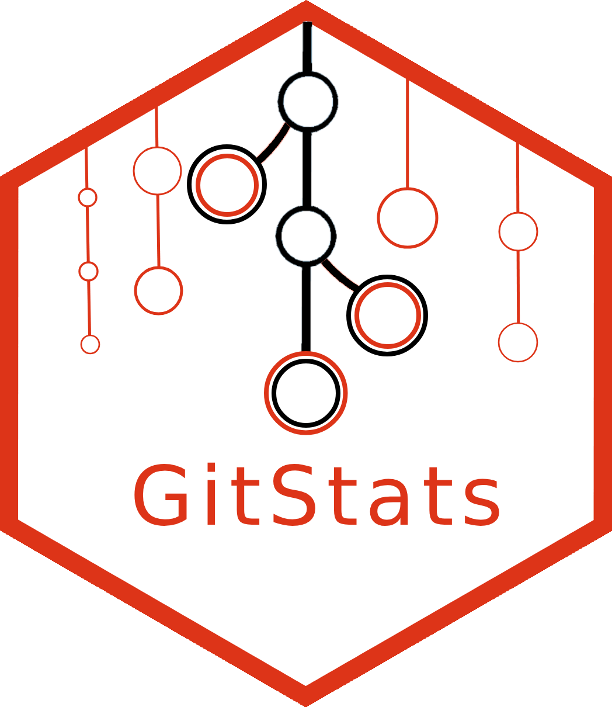

<!-- README.md is generated from README.Rmd. Please edit that file -->

# GitStats 

<!-- badges: start -->

[](https://lifecycle.r-lib.org/articles/stages.html#experimental)
[](https://github.com/r-world-devs/GitStats/actions)
[](https://app.codecov.io/gh/r-world-devs/GitStats?branch=devel)
<!-- badges: end -->

With `GitStats` you can pull git data in a uniform way (table format)
from GitHub and GitLab. For the time-being you can get data on:

- organizations,
- repositories,
- commits,
- issues,
- users,
- release logs,
- text files content,
- R package usage.

You can also prepare basic statistics with `get_*_stats()` functions for
commits and issues.

## Installation

From CRAN:

``` r
install.packages("GitStats")
```

From GitHub:

``` r
devtools::install_github("r-world-devs/GitStats")
```

## Examples:

Setup your `GitStats`:

``` r
library(GitStats)

git_stats <- create_gitstats() |>
  set_gitlab_host(
    repos = "mbtests/gitstatstesting"
  ) |>
  set_github_host(
    orgs = "r-world-devs",
    repos = "openpharma/DataFakeR"
  ) 
```

Get commits:

``` r
commits <- git_stats |>
  get_commits(
    since = "2022-01-01"
  )

commits
#> # A tibble: 2,682 × 11
#>    id    committed_date      author author_login author_name additions deletions
#>    <chr> <dttm>              <chr>  <chr>        <chr>           <int>     <int>
#>  1 7f48… 2024-09-10 11:12:59 Macie… maciekbanas  Maciej Ban…         0         0
#>  2 9c66… 2024-09-10 10:35:37 Macie… maciekbanas  Maciej Ban…         0         0
#>  3 fca2… 2024-09-10 10:31:24 Macie… maciekbanas  Maciej Ban…         0         0
#>  4 e8f2… 2023-03-30 14:15:33 Macie… maciekbanas  Maciej Ban…         1         0
#>  5 7e87… 2023-02-10 09:48:55 Macie… maciekbanas  Maciej Ban…         1         1
#>  6 62c4… 2023-02-10 09:17:24 Macie… maciekbanas  Maciej Ban…         2        87
#>  7 55cf… 2023-02-10 09:07:54 Macie… maciekbanas  Maciej Ban…        92         0
#>  8 C_kw… 2023-05-08 09:43:31 Kryst… krystian8207 Krystian I…        18         0
#>  9 C_kw… 2023-04-28 12:30:40 Kamil… <NA>         Kamil Kozi…        18         0
#> 10 C_kw… 2023-03-01 15:05:10 Kryst… krystian8207 Krystian I…       296       153
#> # ℹ 2,672 more rows
#> # ℹ 4 more variables: repository <chr>, organization <chr>, repo_url <chr>,
#> #   api_url <glue>

commits |>
  get_commits_stats(
    time_aggregation = "month",
    group_var = author
  )
#> # A tibble: 289 × 4
#>    stats_date          githost author             stats
#>    <dttm>              <chr>   <chr>              <int>
#>  1 2022-01-01 00:00:00 github  Admin_mschuemi         1
#>  2 2022-01-01 00:00:00 github  Gowtham Rao            5
#>  3 2022-01-01 00:00:00 github  Krystian Igras         1
#>  4 2022-01-01 00:00:00 github  Martijn Schuemie       1
#>  5 2022-02-01 00:00:00 github  Hadley Wickham         3
#>  6 2022-02-01 00:00:00 github  Martijn Schuemie       2
#>  7 2022-02-01 00:00:00 github  Maximilian Girlich    13
#>  8 2022-02-01 00:00:00 github  Reijo Sund             1
#>  9 2022-02-01 00:00:00 github  eitsupi                1
#> 10 2022-03-01 00:00:00 github  Maximilian Girlich    14
#> # ℹ 279 more rows
```

Get repositories with specific code:

``` r
git_stats |>
  get_repos(
    with_code = "shiny",
    add_contributors = FALSE
  )
#> # A tibble: 8 × 16
#>   repo_id      repo_name         organization fullname platform repo_url api_url
#>   <chr>        <chr>             <chr>        <chr>    <chr>    <chr>    <chr>  
#> 1 R_kgDOHYNOFQ cohortBuilder     r-world-devs r-world… github   https:/… https:…
#> 2 R_kgDOHYNrJw shinyCohortBuild… r-world-devs r-world… github   https:/… https:…
#> 3 R_kgDOIvtxsg GitStats          r-world-devs r-world… github   https:/… https:…
#> 4 R_kgDOJAtHJA shinyTimelines    r-world-devs r-world… github   https:/… https:…
#> 5 R_kgDOJWYrCA hypothesis        r-world-devs r-world… github   https:/… https:…
#> 6 R_kgDOM0o1nA queryBuilder      r-world-devs r-world… github   https:/… https:…
#> 7 R_kgDOM0vVsA shinyQueryBuilder r-world-devs r-world… github   https:/… https:…
#> 8 R_kgDONLzQTw GitAI             r-world-devs r-world… github   https:/… https:…
#> # ℹ 9 more variables: created_at <dttm>, last_activity_at <dttm>,
#> #   last_activity <drtn>, default_branch <chr>, stars <int>, forks <int>,
#> #   languages <chr>, issues_open <int>, issues_closed <int>
```

Get files:

``` r
git_stats |>
  get_files(
    pattern = "\\.md",
    depth = 2L
  )
#> # A tibble: 57 × 8
#>    repo_name      repo_id organization file_path file_content file_size repo_url
#>    <chr>          <chr>   <chr>        <chr>     <chr>            <int> <chr>   
#>  1 GitStats Test… gid://… mbtests      README.md "# GitStats…       122 https:/…
#>  2 shinyGizmo     R_kgDO… r-world-devs NEWS.md   "# shinyGiz…      2186 https:/…
#>  3 shinyGizmo     R_kgDO… r-world-devs README.md "\n# shinyG…      2337 https:/…
#>  4 shinyGizmo     R_kgDO… r-world-devs cran-com… "## Test en…      1700 https:/…
#>  5 cohortBuilder  R_kgDO… r-world-devs NEWS.md   "# cohortBu…      1072 https:/…
#>  6 cohortBuilder  R_kgDO… r-world-devs README.md "\n# cohort…     15830 https:/…
#>  7 shinyCohortBu… R_kgDO… r-world-devs NEWS.md   "# shinyCoh…      2018 https:/…
#>  8 shinyCohortBu… R_kgDO… r-world-devs README.md "\n# shinyC…      3355 https:/…
#>  9 cohortBuilder… R_kgDO… r-world-devs README.md "\n# cohort…      3472 https:/…
#> 10 GitStats       R_kgDO… r-world-devs LICENSE.… "# MIT Lice…      1075 https:/…
#> # ℹ 47 more rows
#> # ℹ 1 more variable: api_url <chr>
```

Get package usage:

``` r
git_stats |>
  get_repos_with_R_packages(
    packages = c("shiny", "purrr"),
    split_output = TRUE
  )
#> $shiny
#> # A tibble: 6 × 19
#>   package package_usage   repo_id  repo_fullname repo_name organization fullname
#>   <chr>   <chr>           <chr>    <chr>         <chr>     <chr>        <chr>   
#> 1 shiny   import          R_kgDOH… r-world-devs… cohortBu… r-world-devs r-world…
#> 2 shiny   import, library R_kgDOH… r-world-devs… shinyCoh… r-world-devs r-world…
#> 3 shiny   import, library R_kgDOJ… r-world-devs… shinyTim… r-world-devs r-world…
#> 4 shiny   import, library R_kgDOJ… r-world-devs… hypothes… r-world-devs r-world…
#> 5 shiny   import, library R_kgDOM… r-world-devs… shinyQue… r-world-devs r-world…
#> 6 shiny   import, library R_kgDON… r-world-devs… GitAI     r-world-devs r-world…
#> # ℹ 12 more variables: platform <chr>, repo_url <chr>, api_url <chr>,
#> #   created_at <dttm>, last_activity_at <dttm>, last_activity <drtn>,
#> #   default_branch <chr>, stars <int>, forks <int>, languages <chr>,
#> #   issues_open <int>, issues_closed <int>
#> 
#> $purrr
#> # A tibble: 8 × 19
#>   package package_usage repo_id    repo_fullname repo_name organization fullname
#>   <chr>   <chr>         <chr>      <chr>         <chr>     <chr>        <chr>   
#> 1 purrr   import        R_kgDOHYN… r-world-devs… cohortBu… r-world-devs r-world…
#> 2 purrr   import        R_kgDOHYN… r-world-devs… shinyCoh… r-world-devs r-world…
#> 3 purrr   import        R_kgDOIvt… r-world-devs… GitStats  r-world-devs r-world…
#> 4 purrr   import        R_kgDOJWY… r-world-devs… hypothes… r-world-devs r-world…
#> 5 purrr   import        R_kgDOM0o… r-world-devs… queryBui… r-world-devs r-world…
#> 6 purrr   import        R_kgDOM0v… r-world-devs… shinyQue… r-world-devs r-world…
#> 7 purrr   import        R_kgDONLz… r-world-devs… GitAI     r-world-devs r-world…
#> 8 purrr   import        MDEwOlJlc… openpharma/D… DataFakeR openpharma   openpha…
#> # ℹ 12 more variables: platform <chr>, repo_url <chr>, api_url <chr>,
#> #   created_at <dttm>, last_activity_at <dttm>, last_activity <drtn>,
#> #   default_branch <chr>, stars <int>, forks <int>, languages <chr>,
#> #   issues_open <int>, issues_closed <int>
#> 
#> attr(,"class")
#> [1] "gitstats_package_usage" "list"                  
#> attr(,"packages")
#> [1] "shiny" "purrr"
#> attr(,"only_loading")
#> [1] FALSE
```

Print `GitStats` to see what it stores:

``` r
git_stats
#> A GitStats object for 2 hosts: 
#> Hosts: https://gitlab.com/api/v4, https://api.github.com
#> Scanning scope: 
#>  Organizations: [1] r-world-devs
#>  Repositories: [2] mbtests/gitstatstesting, openpharma/DataFakeR
#> Storage: 
#>  Repositories: 8 
#>  Commits: 2682 [date range: 2022-01-01 - 2025-04-02]
#>  Files: 57 [file pattern: \.md]
#>  R_package_usage: 2 [packages: shiny, purrr]
```

## See also

`GitStats` is used to facilitate workflow of the `GitAI` R package, a
tool for gathering AI-based knowledge about git repositories:
<https://r-world-devs.github.io/GitAI/>

## Acknowledgement

Special thanks to [James Black](https://github.com/epijim), [Karolina
Marcinkowska](https://github.com/marcinkowskak), [Kamil
Koziej](https://github.com/Cotau), [Matt
Secrest](https://github.com/mattsecrest), [Krystian
Igras](https://github.com/krystian8207), [Kamil
Wais](https://github.com/kalimu), [Adam
Forys](https://github.com/galachad) - for the support in the package
development.
