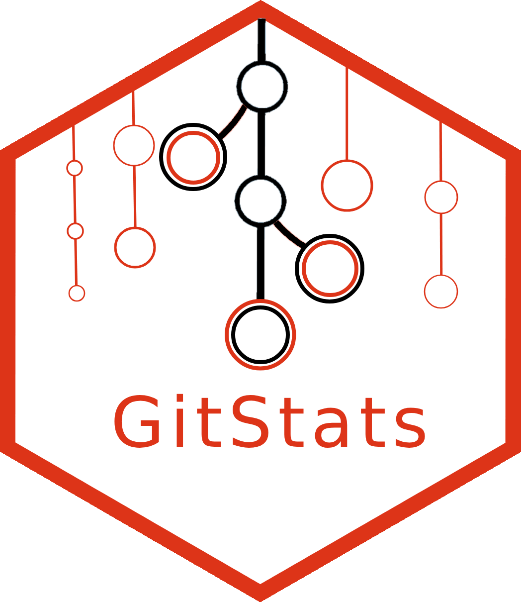

<!-- README.md is generated from README.Rmd. Please edit that file -->

# GitStats 

<!-- badges: start -->

[](https://lifecycle.r-lib.org/articles/stages.html#experimental)
[](https://CRAN.R-project.org/package=GitStats)
[](https://CRAN.R-project.org/package=GitStats)
[](https://github.com/r-world-devs/GitStats/actions)
[](https://app.codecov.io/gh/r-world-devs/GitStats?branch=devel)
<!-- badges: end -->

With `GitStats` you can pull git data in a uniform way from GitHub and
GitLab. For the time-being you can get data on:

- 🏛️ organizations,
- 📘 repositories,
- 🕒 commits,
- 🐛 issues,
- 🔂 pull requests,
- 🙍 users,
- 🚀 release logs,
- 🌲 files tree (structure),
- 📄 text files content.

You can also prepare basic statistics with `get_*_stats()` functions for
commits and issues.

## Installation

From CRAN:

``` r
install.packages("GitStats")
```

From GitHub:

``` r
devtools::install_github("r-world-devs/GitStats")
```

## Examples:

Setup your `GitStats`:

``` r
library(GitStats)

git_stats <- create_gitstats() |>
  set_gitlab_host(
    repos = "mbtests/gitstatstesting"
  ) |>
  set_github_host(
    orgs = "r-world-devs",
    repos = "openpharma/DataFakeR"
  ) 
```

Optionally, you can run `GitStats` functions in parallel (with `mirai`
package underneath):

``` r
set_parallel()
```

Get commits:

``` r
commits <- git_stats |>
  get_commits(
    since = "2022-01-01"
  )

commits
#> # A tibble: 3,510 × 11
#>    repo_name id    committed_date      author author_login author_name additions
#>    <chr>     <chr> <dttm>              <chr>  <chr>        <chr>           <int>
#>  1 gitstats… 7f48… 2024-09-10 11:12:59 Macie… <NA>         Maciej Ban…         0
#>  2 gitstats… 9c66… 2024-09-10 10:35:37 Macie… <NA>         Maciej Ban…         0
#>  3 gitstats… fca2… 2024-09-10 10:31:24 Macie… <NA>         Maciej Ban…         0
#>  4 gitstats… e8f2… 2023-03-30 14:15:33 Macie… <NA>         Maciej Ban…         1
#>  5 gitstats… 7e87… 2023-02-10 09:48:55 Macie… <NA>         Maciej Ban…         1
#>  6 gitstats… 62c4… 2023-02-10 09:17:24 Macie… <NA>         Maciej Ban…         2
#>  7 gitstats… 55cf… 2023-02-10 09:07:54 Macie… <NA>         Maciej Ban…        92
#>  8 shinyGiz… C_kw… 2023-05-08 09:43:31 Kryst… krystian8207 Krystian I…        18
#>  9 shinyGiz… C_kw… 2023-04-28 12:30:40 Kamil… <NA>         Kamil Kozi…        18
#> 10 shinyGiz… C_kw… 2023-03-01 15:05:10 Kryst… krystian8207 Krystian I…       296
#> # ℹ 3,500 more rows
#> # ℹ 4 more variables: deletions <int>, organization <chr>, repo_url <chr>,
#> #   api_url <glue>

commits |>
  get_commits_stats(
    time_aggregation = "month",
    group_var = author
  )
#> # A tibble: 378 × 4
#>    stats_date          githost author             stats
#>    <dttm>              <chr>   <chr>              <int>
#>  1 2022-01-01 00:00:00 github  Admin_mschuemi         1
#>  2 2022-01-01 00:00:00 github  Gowtham Rao            5
#>  3 2022-01-01 00:00:00 github  Krystian Igras         1
#>  4 2022-01-01 00:00:00 github  Martijn Schuemie       1
#>  5 2022-02-01 00:00:00 github  Hadley Wickham         3
#>  6 2022-02-01 00:00:00 github  Martijn Schuemie       2
#>  7 2022-02-01 00:00:00 github  Maximilian Girlich    13
#>  8 2022-02-01 00:00:00 github  Reijo Sund             1
#>  9 2022-02-01 00:00:00 github  eitsupi                1
#> 10 2022-03-01 00:00:00 github  Maximilian Girlich    14
#> # ℹ 368 more rows
```

Get repositories with specific code:

``` r
git_stats |>
  get_repos(
    with_code = "shiny",
    add_contributors = FALSE
  )
#> # A tibble: 9 × 17
#>   repo_id repo_name repo_fullpath default_branch stars forks created_at         
#>   <chr>   <chr>     <chr>         <chr>          <int> <int> <dttm>             
#> 1 R_kgDO… GitAI     r-world-devs… main               8     2 2024-11-07 11:51:03
#> 2 R_kgDO… hypothes… r-world-devs… master             2     0 2023-04-13 13:52:24
#> 3 R_kgDO… shinyGiz… r-world-devs… dev               21     0 2022-04-20 10:04:32
#> 4 R_kgDO… shinyTim… r-world-devs… master             3     0 2023-02-21 16:41:59
#> 5 R_kgDO… shinyCoh… r-world-devs… dev               10     0 2022-05-22 19:04:12
#> 6 R_kgDO… cohortBu… r-world-devs… dev                9     2 2022-05-22 18:31:55
#> 7 R_kgDO… GitStats  r-world-devs… master             9     2 2023-01-09 14:02:20
#> 8 R_kgDO… shinyQue… r-world-devs… master             3     0 2024-09-20 18:59:56
#> 9 R_kgDO… queryBui… r-world-devs… master             1     1 2024-09-20 14:54:12
#> # ℹ 10 more variables: last_activity_at <dttm>, languages <chr>,
#> #   issues_open <int>, issues_closed <int>, organization <chr>, repo_url <chr>,
#> #   commit_sha <chr>, api_url <chr>, githost <chr>, last_activity <drtn>
```

Get files:

``` r
git_stats |>
  get_files(
    pattern = "\\.md",
    depth = 2L
  )
#> # A tibble: 68 × 10
#>    repo_id      repo_name  organization file_path file_content file_size file_id
#>    <chr>        <chr>      <chr>        <chr>     <chr>            <int> <chr>  
#>  1 43398933     gitstatst… mbtests      README.md "# GitStats…       122 fe2407…
#>  2 R_kgDOHNMr2w shinyGizmo r-world-devs NEWS.md   "# shinyGiz…      2186 c13994…
#>  3 R_kgDOHNMr2w shinyGizmo r-world-devs README.md "\n# shinyG…      2337 585f62…
#>  4 R_kgDOHNMr2w shinyGizmo r-world-devs cran-com… "## Test en…      1700 cfcaf4…
#>  5 R_kgDOHYNOFQ cohortBui… r-world-devs NEWS.md   "# cohortBu…      1369 8c5cf3…
#>  6 R_kgDOHYNOFQ cohortBui… r-world-devs README.md "\n# cohort…     13382 ebc919…
#>  7 R_kgDOHYNrJw shinyCoho… r-world-devs NEWS.md   "# shinyCoh…      2213 8b0e9a…
#>  8 R_kgDOHYNrJw shinyCoho… r-world-devs README.md "\n# shinyC…      3355 e49dfe…
#>  9 R_kgDOHYNxtw cohortBui… r-world-devs README.md "\n# cohort…      3472 d4687c…
#> 10 R_kgDOIvtxsg GitStats   r-world-devs LICENSE.… "# MIT Lice…      1075 141471…
#> # ℹ 58 more rows
#> # ℹ 3 more variables: repo_url <chr>, commit_sha <chr>, api_url <chr>
```

Get pull requests:

``` r
git_stats |>
  get_pull_requests(
    since = "2022-01-01"
  )
#> # A tibble: 420 × 10
#>    repo_name       number created_at          merged_at           state  author 
#>    <chr>           <chr>  <dttm>              <dttm>              <chr>  <chr>  
#>  1 gitstatstesting 2      2026-02-25 09:34:18 NA                  closed <NA>   
#>  2 gitstatstesting 1      2026-02-19 11:58:14 NA                  open   <NA>   
#>  3 shinyGizmo      1      2022-04-22 12:49:10 2022-04-22 12:58:32 merged krysti…
#>  4 shinyGizmo      2      2022-05-18 08:21:46 2022-06-02 11:16:13 merged galach…
#>  5 shinyGizmo      10     2022-06-13 09:13:59 2022-06-13 09:25:45 merged krysti…
#>  6 shinyGizmo      11     2022-06-13 10:22:16 2022-06-13 20:08:35 merged krysti…
#>  7 shinyGizmo      13     2022-06-13 21:34:05 2022-06-17 08:49:33 merged stla   
#>  8 shinyGizmo      16     2022-06-15 13:48:08 2022-06-15 14:12:52 merged krysti…
#>  9 shinyGizmo      17     2022-06-17 10:55:10 2022-06-17 10:56:09 merged krysti…
#> 10 shinyGizmo      19     2022-07-05 10:01:44 2022-07-05 11:05:30 merged krysti…
#> # ℹ 410 more rows
#> # ℹ 4 more variables: source_branch <chr>, target_branch <chr>,
#> #   organization <chr>, api_url <glue>
```

Print `GitStats` to see what it stores:

``` r
git_stats
#> A GitStats object for 2 hosts: 
#> Hosts: https://gitlab.com/api/v4, https://api.github.com
#> Scanning scope: 
#>  Organizations: [1] r-world-devs
#>  Repositories: [2] mbtests/gitstatstesting, openpharma/DataFakeR
#> Storage: 
#>  Repositories: 9 
#>  Commits: 3510 [date range: 2022-01-01 - 2026-03-18]
#>  Files: 68 [file pattern: \.md]
#>  Pull_requests: 420 [date range: 2022-01-01 - 2026-03-18]
```

## See also

`GitStats` is used to facilitate workflow of the `GitAI` R package, a
tool for gathering AI-based knowledge about git repositories:
<https://r-world-devs.github.io/GitAI/>

## Acknowledgement

Special thanks to [James Black](https://github.com/epijim), [Karolina
Marcinkowska](https://github.com/marcinkowskak), [Kamil
Koziej](https://github.com/Cotau), [Matt
Secrest](https://github.com/mattsecrest), [Krystian
Igras](https://github.com/krystian8207), [Kamil
Wais](https://github.com/kalimu), [Adam
Forys](https://github.com/galachad) - for the support in the package
development.
