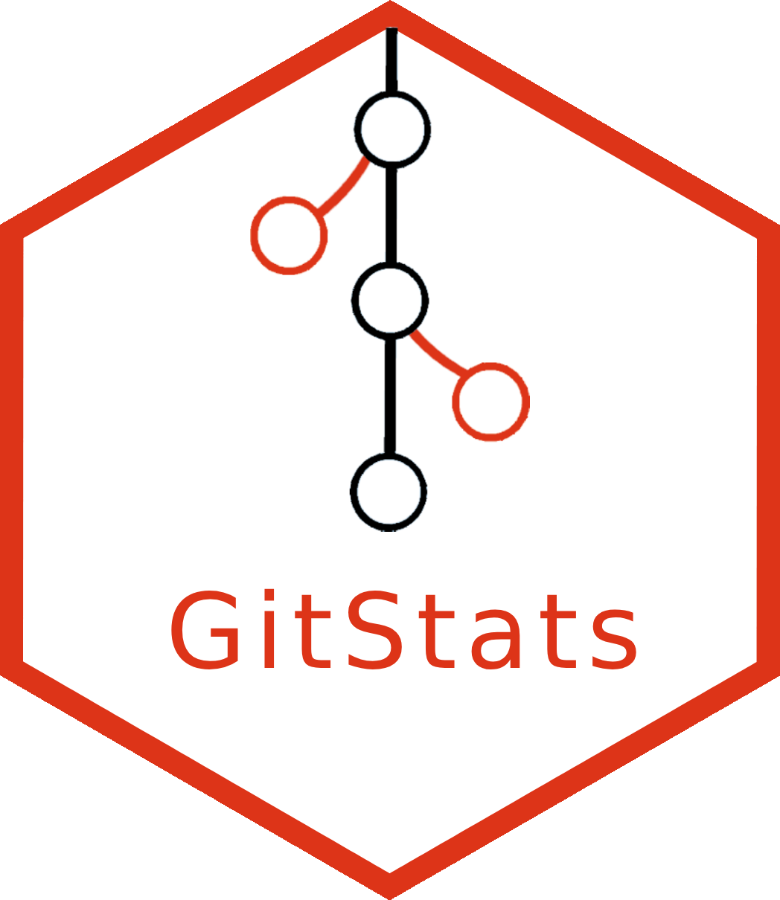

<!-- README.md is generated from README.Rmd. Please edit that file -->

# GitStats 

<!-- badges: start -->

[](https://lifecycle.r-lib.org/articles/stages.html#experimental)
[](https://github.com/r-world-devs/GitStats/actions)
[](https://app.codecov.io/gh/r-world-devs/GitStats?branch=devel)
<!-- badges: end -->

The goal of GitStats is to gather git statistics from different Git
platforms (GitHub and GitLab for the time-being) in a standardized form.

## Installation

CRAN version:

``` r
install.packages("GitStats")
```

GitHub version:

``` r
devtools::install_github("r-world-devs/GitStats")
```

## Setting up your tokens

Please remember to have your access tokens stored as environment
variables: `GITHUB_PAT` for access to GitHub API and `GITLAB_PAT` for
GitLab API.

### Scope of tokens

For `GitStats` to work you need:

- \[GitHub\] `public_repo`, `read:org` and `read:user` scopes,
- \[GitLab\] `read_api` scope.

## GitStats workflow

On how to use GitStats, refer to the
[documentation](https://r-world-devs.github.io/GitStats/index.html).

## Acknowledgement

Special thanks to:

- [Kamil Koziej](https://github.com/Cotau) - for reviewing permanently
  my pull requests and suggesting more efficient solutions,
- [Karolina Marcinkowska](https://github.com/marcinkowskak) - for
  substantial improvements on plots,
- [Krystian Igras](https://github.com/krystian8207) - for the major
  review of GitStats,
- [Matt Secrest](https://github.com/mattsecrest) - for making use of
  your scripts to apply search feature,
- [Kamil Wais](https://github.com/kalimu), [Adam
  Forys](https://github.com/galachad) - for your guidelines at the very
  beginning of the project,
- [James Black](https://github.com/epijim) - for giving a kick-off for
  this project and an inspiration from
  [GithubMetrics](https://github.com/openpharma/GithubMetrics).
